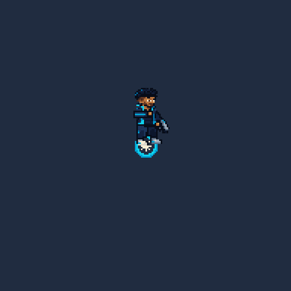

  

  

# Side Quest combat prototype

Hype Man now uses the v7 character set, including four body views, Make Some Noise, On a Roll, and the revised death animations. Editable art is in `art/hypeman/`; see `docs/hypeman-animation.md` for playback details and validation.

Side Quest now has its first native GameMaker combat room. Open `Side Quest.yyp` in GameMaker LTS 2026 and press **F5**, or double-click **Play.cmd** to compile and run with the installed Windows runtime.

This is an early feel prototype with original temporary pixel graphics and synthetic sound cues. The full Bring Ice mission, final art, inventory, additional friends, and progression have not been built.

## Play

Press **Enter** or controller **A / Start** to enter the convenience store. Defeat five enemies to clear the room. The result screen records time, kills, accuracy, and damage; use the same button to restart. Closing the window exits. The prototype does not save progression.

| Action | Keyboard and mouse | Xbox style controller | PlayStation equivalent |
| --- | --- | --- | --- |
| Move | WASD | Left stick | Left stick |
| Aim | Mouse | Right stick | Right stick |
| Fire | Hold left mouse | RT | R2 |
| Dodge | Space or right mouse | A or LB | Cross or L1 |
| Reload | R | X | Square |
| Make Some Noise | E | RB | R1 |
| Pause | Escape | Start | Options |
| Confirm or restart | Enter | A or Start | Cross or Options |

GameMaker must recognize the controller. The input adapter scans available device slots, uses radial stick deadzones, preserves analog movement speed, and retains the last aim direction when the right stick returns to neutral. The most recently active device supplies movement and aim. Focus loss and disconnecting the active controller pause combat. Resume explicitly after returning or reconnecting. Xbox labels are currently used in the game HUD.

## Combat rules

- The Pocket Pistol has eight rounds and unlimited reserve ammunition. Hold fire; reload manually or automatically when attempting to fire an empty magazine.
- Dodge commits to movement direction, or aim direction while stationary. The beginning is invulnerable; the ending is vulnerable. Dodges cannot cross cover or walls and pause reload progress.
- Hype Man passive **On a Roll**: kills refresh a 2.5 second buff to movement and reload speed. The buff does not stack.
- Hype Man active **Make Some Noise**: clears hostile bullets within 84 native pixels and pushes/stuns enemies in range. It deals no damage and has a ten second cooldown. It can pass through cover within its radius, as a provisional rule.
- Orange enemies telegraph a short melee charge. Purple enemies telegraph three-shot fans. The thin attack line shows committed aim, so moving after the warning can avoid the attack.
- Shelves block actors and bullets. The cardboard crate can be destroyed by either side. The exit stays locked until every enemy is defeated; clearing the room ends this prototype rather than opening another location.

## Project layout

`Room1` creates `obj_game` through its room creation code. The controller object handles lifecycle and routes work into separate GML modules. All combat state is held in a run struct, so restart makes a fresh state without stale bullets or cooldowns.

| Module | Responsibility |
| --- | --- |
| sq_config | Tuning defaults and input vector math |
| sq_input | Keyboard, mouse, controller, hotplug and device switching |
| sq_world | Room composition, collision, navigation, run lifecycle |
| sq_combat | Player, gun, dodge, damage, bullets, Hype Man abilities |
| sq_enemies | Melee and ranged behavior and attack tells |
| sq_draw and sq_font | Temporary art, pixel text, HUD and overlays |
| sq_audio | Original generated sound cues and cleanup |
| sq_tests | Automated checks against the actual GML implementation |

The native room is **640 × 360**, displayed at **1280 × 720** with texture filtering disabled. This is a test scale, not final art approval. Timing and movement values live in `sq_config.gml`. Enemy defaults and handmade encounter placement currently live in `sq_enemies.gml` and `sq_world.gml`.

## Build and validation

Run `powershell -NoProfile -ExecutionPolicy Bypass -File tools\Build.ps1 -Action Test` from this folder to compile and run the automated gameplay checks. `-Action Compile` only compiles; `-Action Run` compiles and opens the game. The script locates the installed LTS runtime, stores generated files in `work/`, checks compiler output, and rejects a failing or timed-out test run. No third-party package installation is required.

The first validation ran on GameMaker **2026.0.0.23**. See `docs/validation.md` for exact results and remaining manual checks. A successful compile and automated tests do not establish controller feel, enjoyment, or equivalence to Enter the Gungeon.

Standalone Windows export is currently blocked by the installed GameMaker profile's packaging permission. This source project remains playable through F5 or Play.cmd; no standalone executable is included.

See `docs/production-plan.md` for milestones and `docs/playtest.md` for the next testing session.
