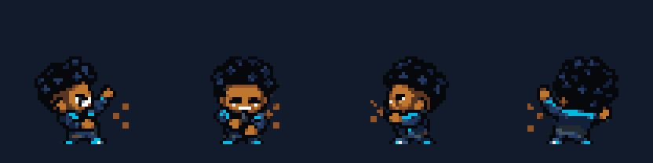

# Hype Man v9 visual review

The v9 actions are in the playable Last Stop room. The creator approved the animations on 29 September 2026. This page preserves the review evidence at two useful scales: a timed clip for motion and an actual GameMaker capture for the room. The engine captures are still frames; the creator's approval supplies the visual judgment they cannot establish.

## Hit reaction

[Four-view engine capture](../art/hypeman-v8-proof/review-v9/game-renders/animation-hit.png) · [combat-room hit](../art/hypeman-v8-proof/review-v9/game-renders/hit.png)

In play, take a hit while standing, moving, and reloading. Does the brief flinch read clearly without hiding movement or the incoming bullet? The visual starts with an immediate 12 ms flash; the directional pose lasts 150 ms.

## Make Some Noise

[Four-view engine capture](../art/hypeman-v8-proof/review-v9/game-renders/animation-noise.png) · [moving room capture](../art/hypeman-v8-proof/review-v9/game-renders/ability-moving.png)

Trigger the ability while moving, then fire and dodge during the gesture. Does the raised-arm pose read through room lighting and bullets? Fire and dodge should respond immediately; the pulse still occurs.

## On a Roll

[Room capture with buff motes](../art/hypeman-v8-proof/review-v9/game-renders/hype.png)

Get a kill, move and fire while the buff is active, then let it expire. Are the cyan motes visible without competing with hostile bullets? Confirm that refresh and expiration are clear in live play; the four-view sprite gallery does not show this world-space effect.

## Death

[Four-view final poses](../art/hypeman-v8-proof/review-v9/game-renders/animation-death.png) · [fall phase](../art/hypeman-v8-proof/review-v9/game-renders/animation-death-fall.png) · [room fall](../art/hypeman-v8-proof/review-v9/game-renders/death-fall.png)

Die facing more than one direction. Does the 80 ms recoil lead into a believable 240 ms backward fall and grounded hold? Check the shelf edge and restart: the corpse should remain visible until restart and the new attempt should begin in idle.

## Decision record

| Action | Creator judgment | Required revision |
| --- | --- | --- |
| Reload | Approved in play on 29 September 2026 | None currently |
| Hit | Approved by creator on 29 September 2026 | None currently |
| Make Some Noise | Approved by creator on 29 September 2026 | None currently |
| On a Roll | Approved by creator on 29 September 2026 | None currently |
| Death | Approved by creator on 29 September 2026 | None currently |

The reference target is Enter the Gungeon's compact, immediate action readability, not a copy of its frames. Research, adopted timing principles, source files, technical verification, and process lessons are in [hypeman-v9-action-pass.md](hypeman-v9-action-pass.md). Broader combat-feel observations still belong in [playtest.md](playtest.md); animation approval does not fill that separate playtest record.
